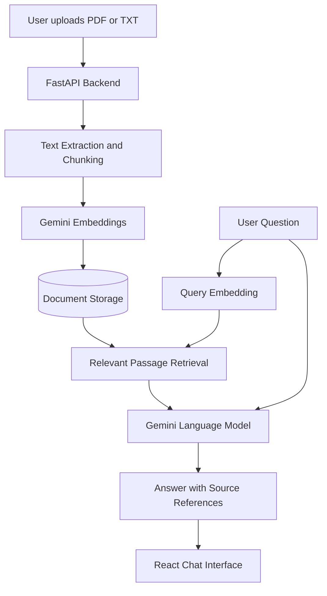

# Atlas — AI Knowledge Assistant

### Full-Stack Document Q&A Using Google Gemini, RAG, React & FastAPI

Atlas is a full-stack AI-powered knowledge assistant that allows users to upload documents, search their contents using natural-language questions, and receive context-aware answers with supporting source references.

It demonstrates Retrieval-Augmented Generation (RAG), semantic embeddings, document processing, REST API development, and modern frontend integration.

> **Project status:** Functional portfolio prototype. Not intended for production use without additional security, evaluation, and deployment work.

## Key Features

- Upload and manage PDF and TXT documents.
- Extract text and split documents into searchable passages.
- Generate semantic document embeddings using Google Gemini.
- Retrieve relevant passages based on the user's question.
- Generate context-grounded answers using a Gemini language model.
- Display source references and retrieved document excerpts.
- Responsive React-based chat interface.
- FastAPI backend with REST endpoints.
- SQLite-based local document storage.
- Optional PostgreSQL/pgvector configuration included.

## Technology Stack

| Layer | Technologies |
|---|---|
| Frontend | React, JavaScript, Vite, CSS |
| Backend | Python, FastAPI |
| Language Model | Google Gemini API |
| Embeddings | Gemini Embedding Model |
| AI Architecture | Retrieval-Augmented Generation |
| Database | SQLite; optional PostgreSQL/pgvector |
| API | REST, JSON |
| Development | Git, GitHub, VS Code |

## RAG Architecture



### How It Works

**1. Document ingestion:** Users upload PDF or TXT files through the frontend.

**2. Text processing:** FastAPI extracts text and divides it into overlapping chunks.

**3. Embedding generation:** The application creates vector representations of the passages using Gemini's embedding API.

**4. Semantic retrieval:** A question is converted into a query embedding and matched against indexed passages.

**5. Answer generation:** Relevant passages are passed to Gemini as grounding context.

**6. Source attribution:** Atlas displays an answer alongside relevant source passages.

## Project Structure

```text
atlas-ai-knowledge-assistant/
├── backend/
│   ├── app/
│   │   ├── main.py
│   │   ├── ai.py
│   │   ├── config.py
│   │   ├── ingestion.py
│   │   └── storage.py
│   ├── tests/
│   ├── requirements.txt
│   └── Dockerfile/
├── frontend/
│   ├── src/
│   │   ├── App.jsx
│   │   ├── main.jsx
│   │   └── style.css
│   └── package.json
├── sample_docs/
├── .env.example
├── .gitignore
├── docker-compose.yml
└── README.md
```

## Local Installation

### Requirements

- Python 3.10+
- Node.js and npm
- Google Gemini API key
- Git

### 1. Clone the repository

```bash
git clone https://github.com/md-shihabulislam/atlas-ai-knowledge-assistant.git

cd atlas-ai-knowledge-assistant
```

### 2. Configure environment variables

Copy `.env.example` to `.env` in the project root.

On Windows PowerShell:

```powershell
Copy-Item .env.example .env
```

Configure your `.env`:

```dotenv
GEMINI_API_KEY=YOUR_GEMINI_API_KEY
GEMINI_CHAT_MODEL=gemini-3.5-flash-lite
GEMINI_EMBEDDING_MODEL=gemini-embedding-2

DATABASE_URL=
CORS_ORIGINS=http://localhost:5173,http://127.0.0.1:5173
```

The configured Gemini models must be available to your API account.

Never commit your actual API key.

### 3. Start the backend

```bash
cd backend

python -m venv .venv
```

Activate the environment:

Windows PowerShell:

```powershell
.\.venv\Scripts\Activate.ps1
```

macOS/Linux:

```bash
source .venv/bin/activate
```

Install dependencies and start FastAPI:

```bash
pip install -r requirements.txt

python -m uvicorn app.main:app --reload
```

Backend: http://localhost:8000

API documentation: http://localhost:8000/docs

### 4. Start the frontend

Open another terminal in the project's frontend directory:

```bash
cd frontend
npm install
npm run dev
```

Frontend: http://localhost:5173

### 5. Test the application

1. Open the frontend in your browser.
2. Upload the example handbook from `sample_docs`.
3. Wait until the document is indexed.
4. Ask a question about the handbook.
5. Inspect the generated answer and source passages.

## API Endpoints

| Method | Endpoint | Description |
|---|---|---|
| GET | /api/health | Check API status |
| GET | /api/documents | List indexed documents |
| POST | /api/documents | Upload a document |
| DELETE | /api/documents/{id} | Delete a document |
| POST | /api/chat | Retrieve context and generate an answer |

Example question payload:

```json
{
  "question": "Summarize the uploaded document."
}
```

## Testing

A backend test suite is included.

To run it:

```bash
cd backend
python -m pytest tests -q
```

The tests should be run against the current Gemini-integrated code before their results are reported.

Live model responses, retrieval quality, and the optional Docker deployment require separate validation.

## Current Limitations

- No user authentication or account management.
- No persistent multi-turn conversation memory.
- No production-grade multi-user document isolation.
- No comprehensive RAG accuracy benchmarking.
- Document analysis and evaluative responses require further refinement.
- API requests are subject to Gemini availability and usage limits.

## Planned Improvements

- Conversation memory and chat history.
- Document comparison and analytical review.
- Hybrid retrieval and relevance reranking.
- Improved source citations.
- Authentication and secure multi-user access.
- Cloud deployment and CI/CD.
- Automated RAG evaluation.

## Security

This is a development prototype.

- Store credentials in the local `.env` file.
- Never commit API keys or private uploaded documents.
- Use fictional documents for public demonstrations.
- Add authentication, access controls, rate limiting, and secure file handling before public deployment.

## Author

**Md Shihabul Islam**

AI Automation & Full-Stack Developer

GitHub: https://github.com/md-shihabulislam

## Disclaimer

This is an independently developed portfolio demonstration project. It is not presented as a commissioned client project or a production-ready enterprise platform.
