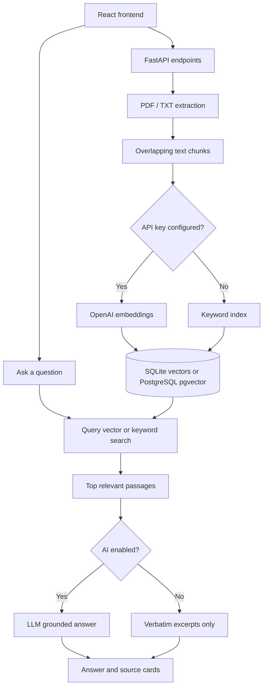

# Atlas — AI Knowledge Assistant (RAG Portfolio Project)

A full-stack, source-aware knowledge assistant. Upload PDF/TXT files, index text passages, ask questions and inspect the passages used to answer. **This is a portfolio prototype, not a production multi-tenant document service.**

## Features

- React/Vite frontend with drag-and-drop uploads and source cards
- FastAPI document ingestion, text extraction and overlapping chunks
- **Zero-key mode:** SQLite + keyword retrieval and verbatim source excerpts (free local demo)
- **AI mode:** OpenAI embeddings (`text-embedding-3-small`) and Responses API answer generation using retrieved context
- **Postgres mode:** PostgreSQL + pgvector cosine similarity via Docker Compose
- Document listing, deletion, upload validation, CORS allowlist
- Demo handbook with answerable questions and tests for ingestion/storage

## Requirements

- Python 3.10+ (3.12 recommended)
- Node.js version compatible with your chosen Vite build (22.12+ recommended)
- Optional: Docker Desktop for PostgreSQL/pgvector setup
- Optional: An OpenAI API key with available API credits (API usage may incur costs)

## Fastest start — no Docker, no API key needed

```bash
# Extract project ZIP, open terminal in its root
cd knowledge-assistant-portfolio

# Terminal 1 — backend
cd backend
python -m venv .venv
# Windows PowerShell: .venv\Scripts\Activate.ps1
# macOS/Linux: source .venv/bin/activate
pip install -r requirements.txt
uvicorn app.main:app --reload --port 8000

# Terminal 2 — frontend (from project root)
cd frontend
npm install
npm run dev
```

Open http://localhost:5173 and upload `sample_docs/example_company_handbook.txt`. Ask "How many days of annual leave are provided?". The offline mode returns relevant passages, **not** an LLM-written answer. This honestly shows retrieval before generative synthesis is configured.

## Turn on AI RAG locally

1. Copy `.env.example` to `.env` in the project root.
2. Set `OPENAI_API_KEY=...` in `.env`, kept **only on the backend**, never inside frontend source code. You can change `OPENAI_CHAT_MODEL` if needed; the default is `gpt-4.1-mini`.
3. **Restart the backend** from the `backend` directory. The app loads `.env` from the root.
4. Re-upload documents indexed in offline mode. Embeddings are computed on ingestion, so old SQLite rows contain no vectors.
5. Ask a question. The app searches embedded chunks and requests a grounded answer with source labels [1], [2], etc.

**Important:** You need API credits independent of any ChatGPT subscription. Do not upload private/client files to third-party services without authorisation. API processing and data handling are subject to the provider's terms.

## Docker Compose (PostgreSQL + pgvector)

With Docker Desktop running, from project root:

```bash
cp .env.example .env     # On Windows, use Copy-Item .env.example .env
# Edit .env if using AI mode
# Start all services
docker compose up --build
```

- Frontend: http://localhost:5173
- API documentation: http://localhost:8000/docs
- Database: PostgreSQL at port 5433 (for local inspection)

Docker Compose sets `DATABASE_URL` to PostgreSQL and enables pgvector. With no `OPENAI_API_KEY`, it uses Postgres full-text retrieval. To enable semantic vector retrieval, set the key and **re-upload documents**.

**Security note:** Docker credentials are intentionally development-only. Change them and add authentication, rate limits, per-user access isolation, and TLS before any public deployment. Never publicly expose the sample database credentials.

## Architecture



## API summary

| Method | Endpoint | Purpose |
|---|---|---|
| GET | `/api/health` | Mode / health indicator |
| GET | `/api/documents` | List indexed documents |
| POST | `/api/documents` | Upload PDF or TXT (max 8MB; PDF max 50 pages) |
| DELETE | `/api/documents/{id}` | Delete indexed document |
| POST | `/api/chat` | Retrieve passages and optionally generate grounded answer |

Example chat payload: `{"question": "What is the annual leave policy?"}`

## Testing

```bash
cd backend
python -m pytest tests -q
```

These tests cover text extraction, chunking, SQLite insert/search/delete and cosine scoring. **They do not test live OpenAI API calls, the full Docker/Postgres path, or factual accuracy of model output.**

## Portfolio evidence checklist

1. Actual welcome screen and uploaded document list
2. PDF/text upload and passage indexing
3. Chat result with citations and visible source excerpts (AI mode)
4. Architecture diagram + stack
5. Test output, failure case, and short walkthrough video

**Do not claim** this prototype includes authentication, multitenancy, OCR, agent tool use, comprehensive evals, or production-grade security. These are planned enhancements.

## Suggested next milestones

- Authentication + per-user document access, file retention and audit logs
- Hybrid search, reranking, user-selectable source documents
- RAG evaluation dataset (answer correctness, citation correctness, retrieval recall)
- Secure deployment to a cloud environment with CI/CD
- Optional local embeddings / open-source LLM support

## Portfolio name

**Atlas — AI Knowledge Assistant | LLM, RAG, React & Python**

Describe this as a *personal demonstration project* until independently tested and deployed. Do not present it as a completed client project.
